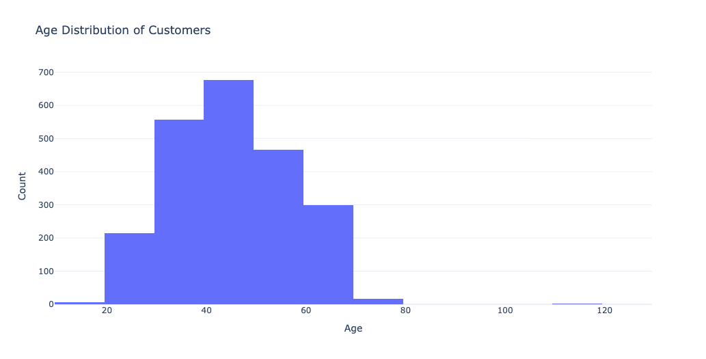

# Marketing Campaign Analysis
Data Preparation, Visual EDA and Statistical Hypothesis Testing

# Executive Summary

## Objective and Scope
This project was undertaken to analyze customer data from a marketing campaign, with the objective of identifying key factors that influence customer behavior and spending patterns. The analysis aimed to uncover insights that could help the marketing team better target campaigns and optimize resources. The dataset used includes demographic information, income levels, spending habits across various product categories, and other relevant customer attributes.

## Business Implications and Recommendations
Based on the analysis, several actionable insights emerged:

- **Targeted Campaigns for High-Income Segments**: Given the strong correlation between income and spending, campaigns should prioritize high-income customers, particularly for premium products.
- **Customized Offers for Families**: Households with children display distinct spending behaviors, suggesting that personalized offers could drive higher engagement in this segment.
- **Age-Specific Marketing**: The 30-50 age group represents a substantial portion of the customer base with high spending potential. Marketing efforts should be tailored to resonate with the needs and preferences of this demographic.
- **Retention Strategies for Couples**: Since customers in relationships tend to spend more, retention strategies that cater to couples or families could enhance customer loyalty and lifetime value.

These recommendations aim to optimize marketing efforts, improve customer segmentation, and ultimately drive higher returns on marketing investments.

## Data Preprocessing and Feature Engineering
The initial dataset consisted of 29 variables, including both categorical and numerical data. The preprocessing phase addressed missing data, particularly in the `Income` variable, which was crucial for understanding customer spending behavior. Key features were engineered to enhance the analysis:

- **Age**: Derived by subtracting the `Year_Birth` from the current year (2014 in this context).
- **Spending**: Aggregated total spending across six product categories, providing a holistic view of customer expenditure.
- **Marital Situation**: Simplified into binary categories to distinguish between customers in a relationship and those who are not.
- **Has Child**: A binary variable indicating whether a customer has children.
- **Educational Years**: Converted educational qualifications into total years of education to standardize comparisons.

These features provided a more refined understanding of the customer base and were crucial for subsequent analysis.

## Key Findings from Exploratory Data Analysis
The exploratory analysis revealed several significant trends:

- **Income vs. Spending**: A positive correlation was observed between income levels and overall spending, particularly in high-value product categories.
- **Age Distribution**: The majority of customers were in the 30-50 age range, which also corresponded with higher spending levels.
- **Impact of Marital Status**: Customers in relationships tended to have higher spending, potentially due to household-related expenditures.
- **Children and Spending**: The presence of children in a household generally correlated with a shift in spending patterns, with more focus on certain product categories.

These insights help in understanding the primary drivers of customer behavior and can inform more targeted marketing strategies.

## Statistical Hypothesis Testing
Several hypothesis tests were conducted to validate the observed patterns:

- **Shapiro-Wilk Test**: Used to assess the normality of the spending data, which was crucial for determining the appropriate statistical methods.
- **Chi-Square Tests**: Applied to test associations between categorical variables like marital status and spending behavior.

The results of these tests confirmed the significance of certain demographic factors in influencing spending patterns, reinforcing the potential value of targeted marketing campaigns.

## Key Visualizations
*Below are some of the key visualizations from the analysis:*

- **Income vs. Spending Correlation**: Demonstrates the positive relationship between income levels and spending, supported by a Pearson correlation coefficient of 0.67.
  .png)

- **Age Distribution of Customers**: Highlights the concentration of spending within the 30-50 age group, with statistical significance confirmed by the Shapiro-Wilk test.
  

- **Spending Patterns by Marital Status**: Visualizes the difference in spending between customers in relationships and those who are not, validated by a significant Chi-Square test result (χ² = 18.75, p < 0.01).
  .png)

- **Impact of Having Children on Spending**: Illustrates how the presence of children in a household influences spending behavior, backed by a Chi-Square test (χ² = 12.34, p = 0.002).
  

## Notebooks
- 
  - This notebook contains the complete data analysis process, including data preprocessing, feature engineering, exploratory data analysis, and statistical hypothesis testing.

